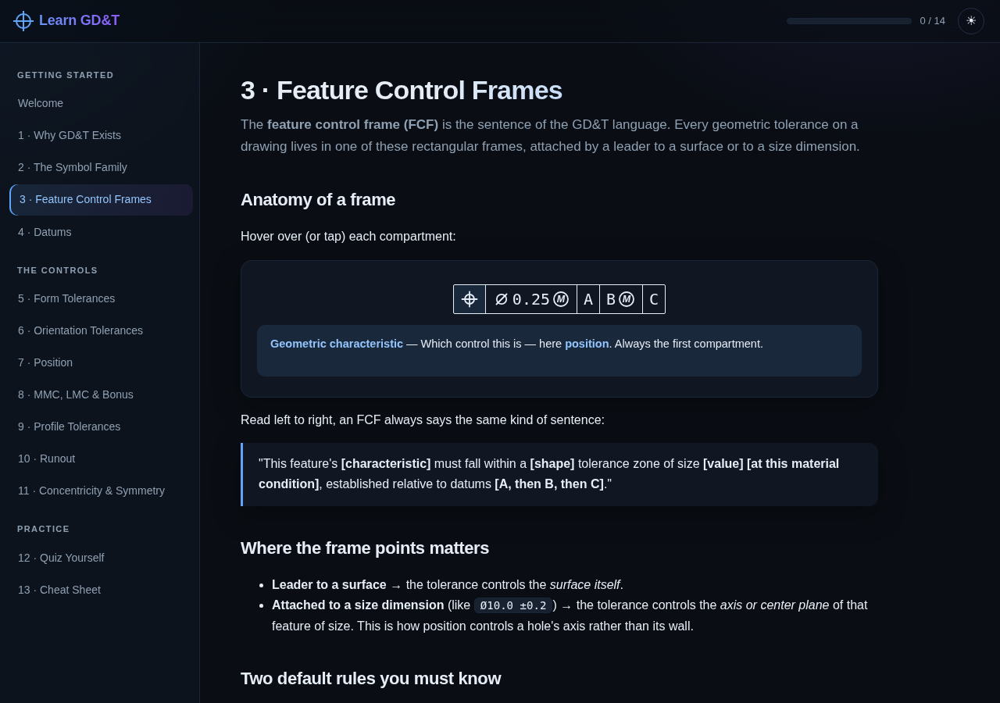
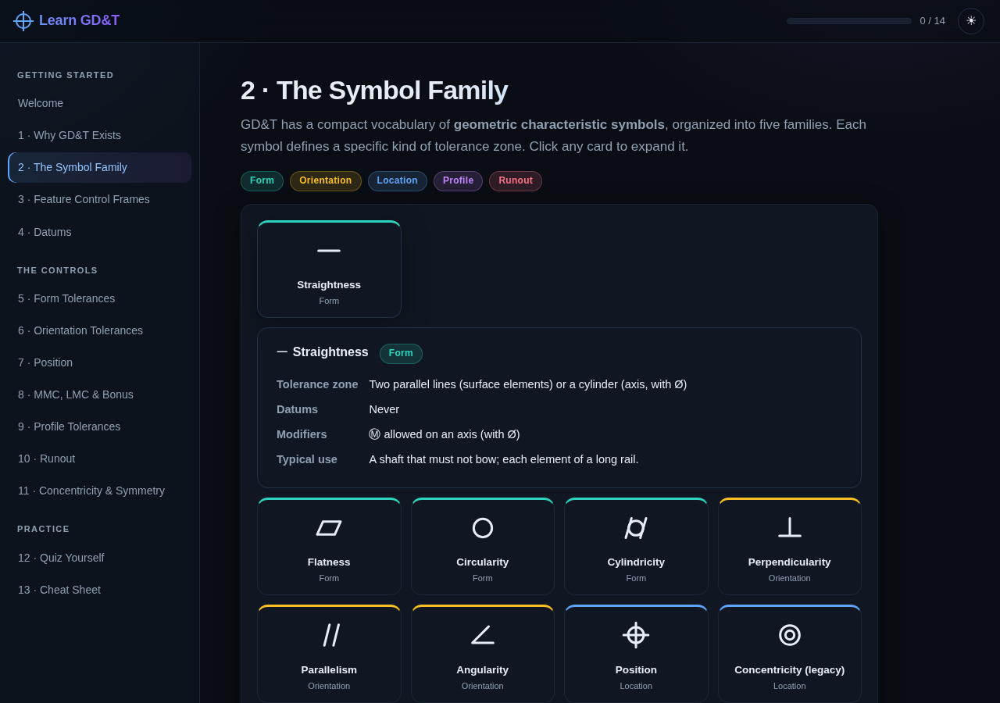

# Learn GD&T

[](LICENSE)


An interactive, browser-based course on **Geometric Dimensioning and Tolerancing** (GD&T, per ASME Y14.5). Written for engineers who are comfortable with ± tolerancing but new to the symbols, feature control frames, and datum letters that cover modern drawings.

Pure HTML/CSS/JavaScript — no frameworks, no build step, no server. Open it and learn.

The UI is built on modern web platform features: dark/light theming with a toggle (respects your OS preference), CSS design tokens with `color-mix()`, a glassmorphism top bar, the View Transitions API for page changes, and motion-safe scroll-reveal animations via IntersectionObserver — all of which run fine on GitHub Pages because they're 100% client-side.

<p align="center">
  
</p>

## Quick start

```bash
git clone https://github.com/morecowbell89/learn-gdt.git
cd learn-gdt
```

Then open `index.html` in any modern browser. That's it.

Prefer a local server? Any static server works:

```bash
python3 -m http.server        # then visit http://localhost:8000
# or
npx http-server
```

## The course

Thirteen self-paced modules, each ending with key takeaways. Progress is saved in your browser.

| # | Module | Interactive widget |
|---|--------|--------------------|
| 1 | Why GD&T Exists | Click-to-test square vs. cylindrical tolerance zone (the classic 57% argument) |
| 2 | The Symbol Family | All 14 geometric characteristic symbols as expandable reference cards |
| 3 | Feature Control Frames | Hoverable FCF anatomy + a live **FCF builder** with plain-English translation |
| 4 | Datums | 3-2-1 rule demo — reorder datum precedence and watch the fixturing change |
| 5 | Form Tolerances | Flatness simulator — squeeze a wavy surface between two planes |
| 6 | Orientation Tolerances | — |
| 7 | Position | Deviation calculator: 2√(ΔX²+ΔY²) with pass/fail visualization |
| 8 | MMC, LMC & Bonus | Bonus tolerance calculator with virtual-condition gauge pin |
| 9 | Profile Tolerances | — |
| 10 | Runout | Animated spinning shaft with dial indicator reading FIM |
| 11 | Concentricity & Symmetry | Legacy symbols (removed in Y14.5-2018) and what to use instead |
| 12 | Quiz Yourself | 10 randomized questions from a 30-question bank + decode-the-frame drill |
| 13 | Cheat Sheet | Every symbol, modifier, formula, and rule on one page |

<p align="center">
  
</p>

## Hosting it (GitHub Pages)

This app is fully static, so GitHub Pages can host it with zero configuration:

1. Go to **Settings → Pages** in this repo.
2. Under *Build and deployment*, choose **Deploy from a branch**, select `main` and `/ (root)`.
3. Visit `https://<username>.github.io/learn-gdt/`.

## Project structure

```
index.html    All lesson content and page structure
styles.css    Styling (no preprocessor)
app.js        SVG symbol library, FCF renderer, widgets, quiz engine, progress tracking
docs/         README screenshots
```

Implementation notes:

- **GD&T symbols are drawn as inline SVG**, not Unicode glyphs, so rendering never depends on font support.
- **Widget diagrams re-theme automatically**: the SVG drawing code uses a fixed palette, and CSS attribute selectors remap every color onto dark/light design tokens.
- **Feature control frames are rendered from a small JSON spec** (`{"sym":"position","dia":true,"tol":"0.25","mod":"M","datums":["A","B","C"]}`), so lessons, the builder, and the drills all share one renderer.
- **Progress and best quiz scores** live in `localStorage` — nothing leaves your browser.

## Accuracy

Content follows **ASME Y14.5** (2009/2018), and notes where the editions differ (e.g., the 2018 removal of concentricity and symmetry). This is a learning aid, not a substitute for the standard — for real engineering decisions, consult Y14.5 itself.

Spotted an error? Issues and pull requests are welcome.

## License

[MIT](LICENSE) — use it, fork it, teach with it.
